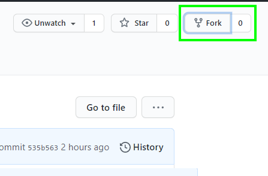
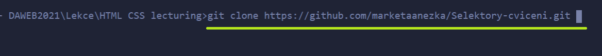
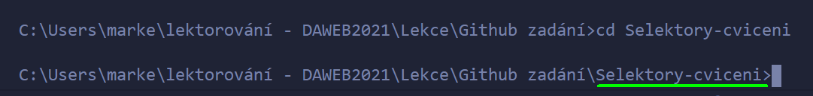

# Cvičení na CSS selektory

## Fork úkolu

1. Přihlas se do Githubu.
2. Udělej si **fork** tohoto repozitáře (vpravo nahoře). Tím se ti úkol zkopíruje to tvého Github účtu.  
 
3. Tento repozitář si ze svého Githubu potom naklonuj k sobě na disk.
 

Zkopíruj si odkaz se záložky **clone** a potom v terminálu ve vybrané složce spusť příkaz `git clone ODKAZ`.   
Například `git clone https://github.com/marketaanezka/Specificita-cviceni.git`.   
Místo `marketaanezka` budeš mít svoje Github uživatelské jméno.   
  

4. Tady už můžeš přidávat, commitovat a pushovat změny a uvidíš je na svém Githubu.   
! Pokud by sis naklonovala rovnou tento repozitář, nemohla bys do něj ukládat změny!   
Na to, jak udělat fork repozitáře se můžes podívat v [krátkém videu](https://youtu.be/K7rE3jRCjD4).   
## Zadání   
Prohlédni si soubor index.html a spusť si ho v Live Serveru. Uvidíš seznam kontaktů.   
    
Prohlédni si strukturu HTML souboru. V HTML nic neupravuj, ani nepřidávej. Stylování piš do souboru style.css na konec.   

### Pro stylování používej pouze selektory typu element, nebo pseudotřídy (nepoužívej třídy)   
1. Každé druhé sekci přidej bílé pozadí    
2. Fotografii přidej 3px silný rámeček barvy lightblue. Dej pozor, aby se rámeček nepřidal i ikonám.     
3. Nastyluj ikony, tak aby se při najetí myši:   
    - ikonka zvětšila. Použij pro to vlasnost a hodnotu `transform: scale(1.3);`   
    - kurzor změnil na pointer/ručičku (vlasnost `cursor`)  
Dej pozor, aby se změny na najetí myši neprojevily i na fotografii. 
#### Bonus    
Pro plynulé zvětšení si najdi použití vlastnosti `transition` a uplatni ho na ikonky.     

## Výsledek      
     

### Ulož si změny do Githubu     
V terminálu se přesuň do správné složky. Pro přesunutí do složky použij  `cd NAZEVSLOZKY`, pro přesun o složku výš použij `cd ..`   
    
Ve složce postupně spusť tyto příkazy:    

1. `git add .`
2. `git commit -m "Moje zprava"`
3. `git push`
